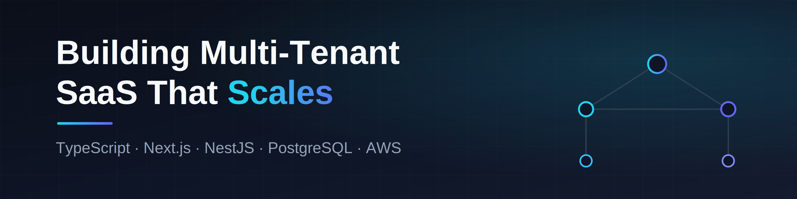

<h1 align="center">Hi,  I'm Yevhenii Lukashov</h1>

  

 
  
  
  <a href="https://www.codewars.com/users/EuJinnLucaShow">
  

   ㅤㅤㅤㅤㅤㅤㅤㅤ
  

  
  

    
   

| Category                     | Technologies                                                                                                                                                                                                                                                                                                                                                                                                                                                                                                                                                                                                                                                                                                                                                                           |
| ---------------------------- | -------------------------------------------------------------------------------------------------------------------------------------------------------------------------------------------------------------------------------------------------------------------------------------------------------------------------------------------------------------------------------------------------------------------------------------------------------------------------------------------------------------------------------------------------------------------------------------------------------------------------------------------------------------------------------------------------------------------------------------------------------------------------------------- |
| ⌨️ IDE                       | &nbsp;&nbsp;                                                                                                                                                                                                                                                                                                                                                             |
| ⚙️ Services and Apps         | &nbsp;&nbsp;&nbsp;&nbsp;                                                                                                                                                   |
| 📄 CLI & Environment         | &nbsp;&nbsp;&nbsp;                                                                                                                                                                                                                                                                                              |
| 🌐 Programming language      | &nbsp;                                                                                                                                                                                                                                                                                                                                                                                                                                                                                                              |
| ⚗️ Runtime & Version Manager | &nbsp;                                                                                                                                                                                                                                                                                                                                                                                                                                                                                                                                             |
| 📚 JS Libraries              | &nbsp;&nbsp;&nbsp;&nbsp;                                                                                                                                                      |
| 🛠️ Frameworks                | &nbsp;&nbsp;&nbsp;                                                                                                                                                                                                                                                                                          |
| 📝 Web Tech                  | &nbsp;&nbsp;&nbsp;                                                                                                                                                                                                                                                                                            |
| 💅 CSS Tools                 | &nbsp;&nbsp;&nbsp;&nbsp;&nbsp; |
| 📦 Package Mgmt              | &nbsp;                                                                                                                                                                                                                                                                                                                                                                                                                                                                                                                                                          |
| 📦 Bundlers                  | &nbsp;&nbsp;                                                                                                                                                                                                                                                                                                                                                                                                                            |
| 🗃️ Databases                 | &nbsp;                                                                                                                                                                                                                                                                                                                                                                                                                                                                                                                                       |
| 🌩️ BaaS                      | &nbsp;                                                                                                                                                                                                                                                                                                                                                                                                                                                                                                                                         |
| ☁️ Cloud & Third-party APIs  | &nbsp;&nbsp;                                                                                                                                                                                                                                                                                                                                                                                                                           |
